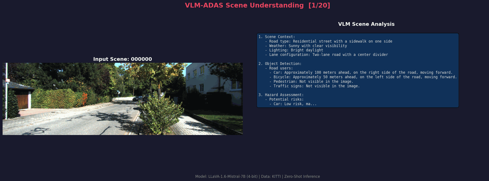
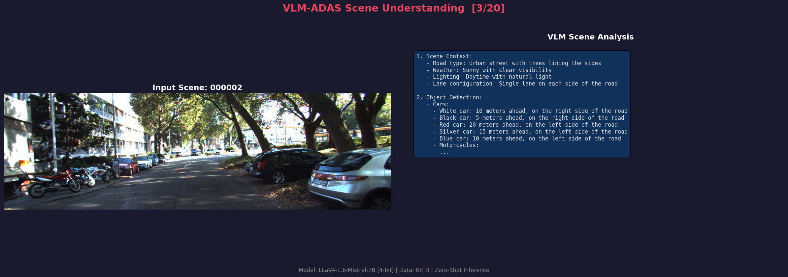
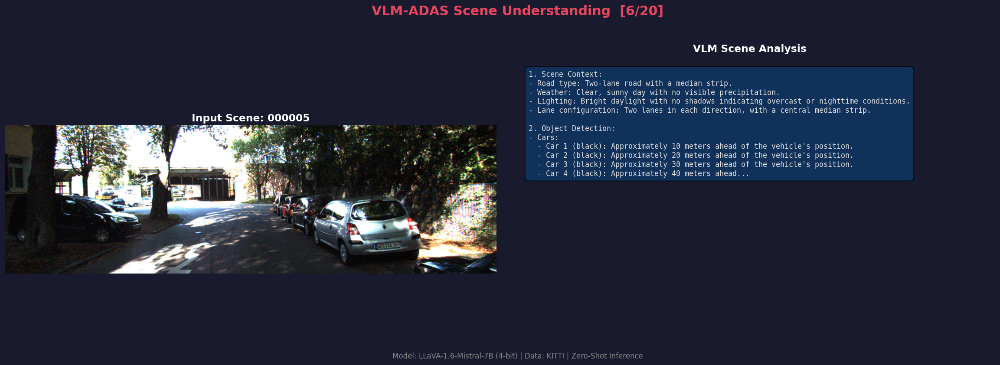
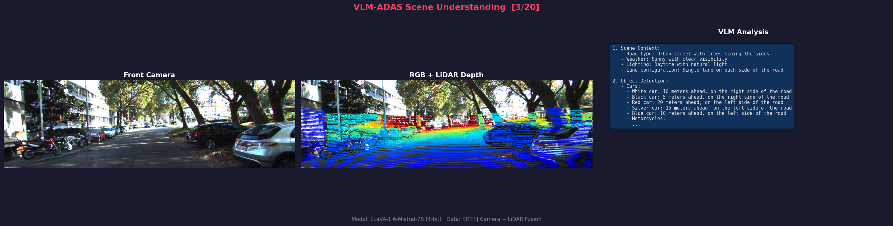
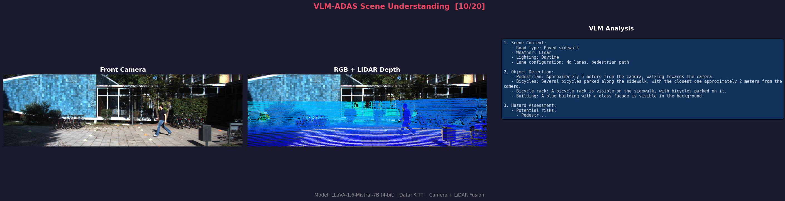

<div align="center">
 
# 🚗 VLM-LiDAR-Camera-ADAS-Perception  
 
### Zero-Shot Autonomous Driving Scene Understanding with Vision Language Models

[](https://colab.research.google.com/github/VasuTammisetti/VLM-LiDAR-Camera-ADAS-perception/blob/main/notebooks/vlm_adas_demo.ipynb)
[](https://python.org)
[](https://pytorch.org)
[](docker/)
[](Jenkinsfile)
[](LICENSE)

**A multi-modal perception system that leverages pre-trained Vision Language Models to analyze driving scenes using Camera and LiDAR data — with zero training, zero annotations, and zero fine-tuning.**

---

</div>

## 🎬 Demo

### RGB Scene Analysis

The model analyzes raw camera images, identifying road users, assessing hazards, and recommending driving actions — all in a single forward pass.

<div align="center">

</div>

<br/>

### Camera + LiDAR Fusion Analysis

LiDAR point clouds projected onto camera images as depth-colored overlays. The VLM uses this fused view to estimate distances and prioritize hazards.  

<div align="center">

</div>

---

## 🔍 Detailed Results

### Scene Analysis — RGB Input

The VLM receives a raw driving image and produces structured perception output: scene context, detected objects with positions, hazard severity ranking, and a driving recommendation.

<div align="center">

</div>

<br/>

<div align="center">

</div>

<br/>

### Scene Analysis — Camera + LiDAR Fusion

Three-panel view: Front Camera (RGB) | RGB + LiDAR Depth Overlay | VLM Analysis. Depth colors encode distance — blue is close (0-10m), green is mid-range (10-25m), red is far (25-50m). The VLM leverages these depth cues for distance-aware hazard assessment.

<div align="center">

</div>

<br/>

<div align="center">

</div>

---

## 💡 Why This Project?

Traditional ADAS perception pipelines require thousands of annotated images, weeks of training, and task-specific architectures. This project takes a fundamentally different approach:

| | Traditional Pipeline | This Project |
|:---|:---:|:---:|
| **Training Data** | Thousands of labeled images | **Zero annotations** |
| **Model Training** | Task-specific, weeks of GPU time | **Pre-trained VLM, zero-shot** |
| **Architecture** | Separate model per task | **One model, multiple capabilities** |
| **Setup Time** | Weeks | **Minutes** |
| **Output Format** | Fixed categories | **Free-form natural language** |

---

## 🏗️ Architecture
```
┌────────────────────────────────────────────────────────────────────┐
│                       Input Pipeline                               │
│                                                                    │
│   KITTI Camera (RGB) ─────┐                                        │
│                            ├──► Preprocessing ──┐                  │
│   KITTI LiDAR (Velodyne) ─┘                     │                  │
│       │                                         ▼                  │
│       ├──► Depth Projection ──► RGB+Depth ──► VLM Engine           │
│       │    (P2 × R0 × Tr)      Overlay       (LLaVA-1.6-Mistral   │
│       │                                       7B, 4-bit NF4)      │
│       └──► BEV Generation ──► Bird's Eye          │               │
│                                View                ▼               │
│                                           Structured Output        │
│                                            ├─ Scene Context        │
│                                            ├─ Object Detection     │
│                                            ├─ Hazard Assessment    │
│                                            └─ Drive Recommendation │
└────────────────────────────────────────────────────────────────────┘
```

---

## ✨ Key Features

- **Zero-Shot Scene Analysis** — No training or annotations needed. The pre-trained VLM understands driving scenes using carefully engineered ADAS-specific prompts.

- **Camera-LiDAR Fusion** — Velodyne 3D points projected onto 2D images via KITTI calibration (P2, R0_rect, Tr_velo_to_cam), creating depth-aware inputs.

- **Bird's Eye View** — Top-down LiDAR representation for spatial awareness (40m × 40m, 0.1m resolution).

- **Multi-Prompt Pipeline** — Four specialized modes: full analysis, hazard-only, depth-aware, and object counting.

- **4-bit Quantization** — Runs on consumer GPUs (RTX 2070, 8GB VRAM) using NF4 quantization via bitsandbytes.

- **CI/CD Pipeline** — Dockerized testing and deployment with Jenkins.

---

## 🚀 Quick Start

### Option 1: Google Colab (Recommended — Free GPU)

[](https://colab.research.google.com/github/VasuTammisetti/VLM-LiDAR-Camera-ADAS-perception/blob/main/notebooks/vlm_adas_demo.ipynb)

### Option 2: Local (RTX 2070+ / 8GB VRAM)
```bash
git clone https://github.com/VasuTammisetti/VLM-LiDAR-Camera-ADAS-perception.git
cd VLM-LiDAR-Camera-ADAS-perception

python -m venv venv
source venv/bin/activate          # Linux/Mac
venv\\Scripts\\activate           # Windows

pip install -r requirements.txt
python run_demo.py --env local --model llava-1.5-7b --num_scenes 5
```

### Option 3: Docker
```bash
docker compose run inference      # GPU inference
docker compose run test           # Unit tests (no GPU)
docker compose run lint           # Code linting
```

---

## 📁 Project Structure
```
VLM-LiDAR-Camera-ADAS-perception/
├── src/
│   ├── config.py              # Environment-aware data paths
│   ├── model_loader.py        # VLM loading with 4-bit quantization
│   ├── scene_analyzer.py      # ADAS prompt templates + inference
│   └── visualization.py       # LiDAR projection, BEV, result display
├── tests/                     # 11 unit tests (GPU-free)
├── docker/                    # GPU + CI Dockerfiles
├── outputs/examples/          # Demo GIFs and showcase images
├── data/sample_scenes/        # Sample KITTI frames
├── Jenkinsfile                # CI/CD pipeline
├── docker-compose.yml         # Multi-service orchestration
├── run_demo.py                # CLI entry point
└── generate_demo_gif.py       # Demo GIF generator
```

---

## 🔧 Prompt Engineering

The core innovation — transforming a general-purpose VLM into an ADAS perception system through prompt design:

| Mode | Purpose | Example Output |
|:---|:---|:---|
| `full_analysis` | Complete scene breakdown | Scene context + objects + hazards + recommendation |
| `hazard_only` | Risk-focused detection | Hazard type, location, severity, action |
| `depth_aware` | Distance estimation via LiDAR overlay | Proximity-based hazard priority |
| `object_count` | Exhaustive enumeration | Object type, position, distance, motion state |

---

## 🧠 Models

| Model | VRAM | Speed | Quality | GPU Requirement |
|:---|:---:|:---:|:---:|:---|
| **LLaVA-1.6-Mistral-7B** (4-bit) | ~5-6 GB | Moderate | High | RTX 2070+ / T4 |
| PaliGemma-3B (4-bit) | ~3-4 GB | Fast | Good | Any CUDA GPU |

---

## 🔄 CI/CD Pipeline
```
git push ──► Jenkins ──► Build Test Container (no GPU)
                              ├── Lint (flake8)
                              ├── Unit Tests (pytest, 11 tests)
                              └── Build & Push Docker Image
```

---

## 📊 Technical Details

| Component | Detail |
|:---|:---|
| **LiDAR Projection** | 3D → 2D via P2 × R0_rect × Tr_velo_to_cam |
| **Depth Encoding** | Jet colormap: blue (0-10m), green (10-25m), red (25-50m) |
| **BEV Resolution** | 40m × 40m at 0.1m per pixel |
| **Quantization** | 4-bit NF4 (14GB model → 5GB VRAM) |
| **Dataset** | KITTI: RGB 1242×375, Velodyne 64-beam ~120K pts/frame |
| **Inference** | Zero-shot, no training, no annotations |

---

## 🛠️ Tech Stack

`Python` `PyTorch` `HuggingFace Transformers` `LLaVA` `bitsandbytes` `KITTI` `Docker` `Jenkins` `NumPy` `Matplotlib`

---

## 👤 Author

**Vasu Tammisetti**
AI Research Engineer & Doctoral Researcher — Infineon Technologies AG, Munich
PhD: Meta-Learning for ADAS Perception — University of Granada

[](https://github.com/VasuTammisetti)

---

## 📝 License

This project is licensed under the [MIT License](LICENSE).

---

<div align="center">

⭐ **Star this repository if you find it useful!** ⭐

</div>
