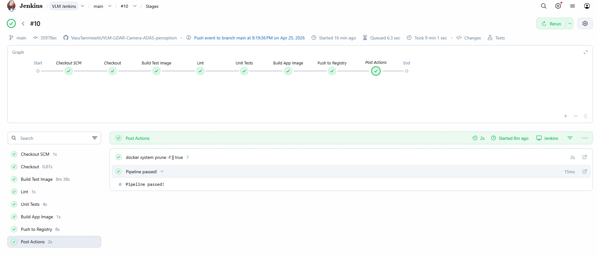
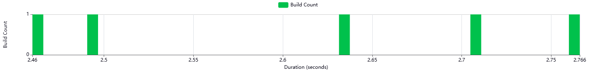

<div align="center">
 
# 🚗 VLM-LiDAR-Camera-ADAS-Perception  
 
### Zero-Shot Autonomous Driving Scene Understanding with Vision Language Models

[](https://colab.research.google.com/github/VasuTammisetti/VLM-LiDAR-Camera-ADAS-perception/blob/main/notebooks/vlm_adas_demo.ipynb)
[](https://python.org)
[](https://pytorch.org)
[](docker/)
[](Jenkinsfile)
[](https://hub.docker.com/r/tammisetti/vlm-adas-app)
[](Jenkinsfile)
[](LICENSE)

**A multi-modal perception system that leverages pre-trained Vision Language Models to analyze driving scenes using Camera and LiDAR data — with zero training, zero annotations, and zero fine-tuning.**

---

</div>

## 🎬 Demo

### RGB Scene Analysis

The model analyzes raw camera images, identifying road users, assessing hazards, and recommending driving actions — all in a single forward pass.

<div align="center">

</div>

<br/>

### Camera + LiDAR Fusion Analysis

LiDAR point clouds projected onto camera images as depth-colored overlays. The VLM uses this fused view to estimate distances and prioritize hazards.  

<div align="center">

</div>

---

## 🔍 Detailed Results

### Scene Analysis — RGB Input

The VLM receives a raw driving image and produces structured perception output: scene context, detected objects with positions, hazard severity ranking, and a driving recommendation.

<div align="center">

</div>

<br/>

<div align="center">

</div>

<br/>

### Scene Analysis — Camera + LiDAR Fusion

Three-panel view: Front Camera (RGB) | RGB + LiDAR Depth Overlay | VLM Analysis. Depth colors encode distance — blue is close (0-10m), green is mid-range (10-25m), red is far (25-50m). The VLM leverages these depth cues for distance-aware hazard assessment.

<div align="center">

</div>

<br/>

<div align="center">

</div>

---

## 💡 Why This Project?

Traditional ADAS perception pipelines require thousands of annotated images, weeks of training, and task-specific architectures. This project takes a fundamentally different approach:

| | Traditional Pipeline | This Project |
|:---|:---:|:---:|
| **Training Data** | Thousands of labeled images | **Zero annotations** |
| **Model Training** | Task-specific, weeks of GPU time | **Pre-trained VLM, zero-shot** |
| **Architecture** | Separate model per task | **One model, multiple capabilities** |
| **Setup Time** | Weeks | **Minutes** |
| **Output Format** | Fixed categories | **Free-form natural language** |

---

## 🏗️ Architecture
```
┌────────────────────────────────────────────────────────────────────┐
│                       Input Pipeline                               │
│                                                                    │
│   KITTI Camera (RGB) ─────┐                                        │
│                            ├──► Preprocessing ──┐                  │
│   KITTI LiDAR (Velodyne) ─┘                     │                  │
│       │                                         ▼                  │
│       ├──► Depth Projection ──► RGB+Depth ──► VLM Engine           │
│       │    (P2 × R0 × Tr)      Overlay       (LLaVA-1.6-Mistral   │
│       │                                       7B, 4-bit NF4)      │
│       └──► BEV Generation ──► Bird's Eye          │               │
│                                View                ▼               │
│                                           Structured Output        │
│                                            ├─ Scene Context        │
│                                            ├─ Object Detection     │
│                                            ├─ Hazard Assessment    │
│                                            └─ Drive Recommendation │
└────────────────────────────────────────────────────────────────────┘
```

---

## ✨ Key Features

- **Zero-Shot Scene Analysis** — No training or annotations needed. The pre-trained VLM understands driving scenes using carefully engineered ADAS-specific prompts.

- **Camera-LiDAR Fusion** — Velodyne 3D points projected onto 2D images via KITTI calibration (P2, R0_rect, Tr_velo_to_cam), creating depth-aware inputs.

- **Bird's Eye View** — Top-down LiDAR representation for spatial awareness (40m × 40m, 0.1m resolution).

- **Multi-Prompt Pipeline** — Four specialized modes: full analysis, hazard-only, depth-aware, and object counting.

- **4-bit Quantization** — Runs on consumer GPUs (RTX 2070, 8GB VRAM) using NF4 quantization via bitsandbytes.

- **Production-Grade CI/CD** — Webhook-triggered Jenkins pipeline with automated testing and Docker Hub publishing — see [CI/CD section](#-cicd-pipeline) below.

---

## 🚀 Quick Start

### Option 1: Google Colab (Recommended — Free GPU)

[](https://colab.research.google.com/github/VasuTammisetti/VLM-LiDAR-Camera-ADAS-perception/blob/main/notebooks/vlm_adas_demo.ipynb)

### Option 2: Local (RTX 2070+ / 8GB VRAM)
```bash
git clone https://github.com/VasuTammisetti/VLM-LiDAR-Camera-ADAS-perception.git
cd VLM-LiDAR-Camera-ADAS-perception

python -m venv venv
source venv/bin/activate          # Linux/Mac
venv\\Scripts\\activate           # Windows

pip install -r requirements.txt
python run_demo.py --env local --model llava-1.5-7b --num_scenes 5
```

### Option 3: Docker (Pre-built image on Docker Hub)
```bash
# Pull the latest CI-built image
docker pull tammisetti/vlm-adas-app:latest

# Or use docker-compose for local builds
docker compose run inference      # GPU inference
docker compose run test           # Unit tests (no GPU)
docker compose run lint           # Code linting
```

---

## 📁 Project Structure
```
VLM-LiDAR-Camera-ADAS-perception/
├── src/
│   ├── config.py              # Environment-aware data paths
│   ├── model_loader.py        # VLM loading with 4-bit quantization
│   ├── scene_analyzer.py      # ADAS prompt templates + inference
│   └── visualization.py       # LiDAR projection, BEV, result display
├── tests/                     # 11 unit tests (GPU-free)
├── docker/                    # GPU + CI Dockerfiles
├── outputs/examples/          # Demo GIFs and showcase images
├── data/sample_scenes/        # Sample KITTI frames
├── Jenkinsfile                # CI/CD pipeline
├── docker-compose.yml         # Multi-service orchestration
├── run_demo.py                # CLI entry point
└── generate_demo_gif.py       # Demo GIF generator
```

---

## 🔧 Prompt Engineering

The core innovation — transforming a general-purpose VLM into an ADAS perception system through prompt design:

| Mode | Purpose | Example Output |
|:---|:---|:---|
| `full_analysis` | Complete scene breakdown | Scene context + objects + hazards + recommendation |
| `hazard_only` | Risk-focused detection | Hazard type, location, severity, action |
| `depth_aware` | Distance estimation via LiDAR overlay | Proximity-based hazard priority |
| `object_count` | Exhaustive enumeration | Object type, position, distance, motion state |

---

## 🧠 Models

| Model | VRAM | Speed | Quality | GPU Requirement |
|:---|:---:|:---:|:---:|:---|
| **LLaVA-1.6-Mistral-7B** (4-bit) | ~5-6 GB | Moderate | High | RTX 2070+ / T4 |
| PaliGemma-3B (4-bit) | ~3-4 GB | Fast | Good | Any CUDA GPU |

---

## 🔄 CI/CD Pipeline

> **Production-grade automation for safety-critical perception code.** Every commit to `main` triggers a fully containerized pipeline that lints, tests, builds, and publishes a Docker image — with sub-3-second webhook latency and zero manual intervention.

### Why CI/CD Matters for Sensor Fusion

ADAS perception code is safety-critical. A regression in calibration math, a broken LiDAR projection, or an untested change to the VLM prompt can degrade real-world driving decisions. This pipeline enforces a quality gate on every push:

- **Reproducibility** — every test runs in an isolated Docker container, identical across machines, ensuring "works on my laptop" never reaches production.
- **Regression catching** — 11 unit tests cover calibration math, LiDAR projection, prompt structure, and model loading interfaces. A broken commit gets rejected before merge.
- **Auditable history** — every build is traceable to a Git commit, a Docker image digest, and a JUnit test report. Critical for any safety-critical software lifecycle (ISO 26262 / ASPICE alignment).
- **Fast feedback** — webhook triggers mean developers see lint/test failures within minutes, not hours.

### Pipeline Architecture

```
                              GitHub Webhook (~2s latency)
                                        │
   git push origin main ──────────────►─┘
                                        │
                                        ▼
                            ┌──────────────────────────┐
                            │   Jenkins Multi-branch   │
                            │   Pipeline (Dockerized)  │
                            └────────────┬─────────────┘
                                         │
        ┌────────────────────────────────┼────────────────────────────────┐
        ▼                                ▼                                ▼
   ┌─────────┐  ┌──────────────┐  ┌───────────┐  ┌────────────┐  ┌──────────────┐  ┌────────────┐
   │Checkout │─►│ Build Test   │─►│   Lint    │─►│   Unit     │─►│  Build App   │─►│   Push to  │
   │  SCM    │  │   Image      │  │ (flake8)  │  │   Tests    │  │    Image     │  │  Registry  │
   │  (1s)   │  │  (~30s cached)│  │   (1s)    │  │ (11 tests) │  │ (production) │  │ (Docker Hub)│
   └─────────┘  └──────────────┘  └───────────┘  └────────────┘  └──────────────┘  └────────────┘
                                         │
                                         ▼
                            ┌──────────────────────────┐
                            │   tammisetti/vlm-adas-   │
                            │   app:{build_num}, latest│
                            │      (Docker Hub)        │
                            └──────────────────────────┘
```

### Live Pipeline Status

<div align="center">

#### Build #10 — All Stages Green ✅



*Triggered by webhook 2 seconds after `git push`. End-to-end build time including Docker layer caching: ~9 minutes (first build), ~2 minutes (cached).*

</div>

<div align="center">

#### Test Results — 11/11 Passing in 2.4 seconds


*Comprehensive coverage across calibration, LiDAR projection, prompt validation, and model loading interfaces.*

</div>

<div align="center">

#### Test Suite Performance — Consistent Sub-3-Second Execution



*Build-over-build duration distribution shows stable test performance — no flaky tests, no creeping latency.*

</div>

### What Each Stage Validates

| Stage | What It Checks | Why It Matters for Sensor Fusion |
|:---|:---|:---|
| **Checkout SCM** | Pulls exact commit from GitHub | Reproducibility — every build is traceable to a single SHA |
| **Build Test Image** | Builds Python + PyTorch + CUDA test environment | Ensures the fusion stack installs cleanly from `requirements.txt` on every commit |
| **Lint (flake8)** | Static analysis of all `src/` code | Catches syntax errors, unused variables, and style violations before they hit production |
| **Unit Tests (pytest)** | Runs 11 tests covering core fusion logic | Validates KITTI calibration math, point-cloud projection, prompt templates, and model interfaces |
| **Build App Image** | Builds the production GPU runtime image | Verifies the deployable container builds end-to-end on every commit |
| **Push to Registry** | Tags and publishes to Docker Hub | Every green commit produces a runnable, versioned artifact (`tammisetti/vlm-adas-app:{N}`) |

### Test Coverage Breakdown

```
tests/test_model_loader.py           ── 2 tests   ── Model config + invalid model handling
tests/test_scene_analyzer.py         ── 4 tests   ── Prompt structure, completeness, sections
tests/test_visualization.py          ── 5 tests   ── LiDAR projection, calibration shapes, frustum culling
                                      ────────
                                       11 passing  ── 2.4 seconds total
```

The tests deliberately cover the **non-ML logic that's most likely to silently break under refactoring** — calibration matrix shapes, point-cloud filtering, prompt structure. The VLM itself is treated as a black-box dependency.

### Tech Stack — CI/CD Layer

| Component | Tool | Purpose |
|:---|:---|:---|
| **CI Orchestration** | Jenkins LTS (in Docker) | Multi-branch Pipeline auto-discovers all branches |
| **Trigger** | GitHub Webhook + ngrok | ~2-second latency from `git push` to build start |
| **Containerization** | Docker + Docker-in-Docker | Every stage runs in an ephemeral container |
| **Static Analysis** | flake8 | Code style + unused variable detection |
| **Testing** | pytest + JUnit XML | Test results displayed natively in Jenkins UI |
| **Registry** | Docker Hub ([tammisetti/vlm-adas-app](https://hub.docker.com/r/tammisetti/vlm-adas-app)) | Public versioned artifacts |
| **Credentials** | Jenkins Credentials Manager | GitHub PAT + Docker Hub PAT (scoped, rotatable) |
| **Fallback** | 1-minute polling | Survives webhook outages without losing builds |

### Reproducing the Pipeline Locally

```bash
# Run Jenkins locally (one-time setup)
docker volume create jenkins_home
docker run -d --name jenkins \
  -p 8080:8080 -p 50000:50000 \
  -v jenkins_home:/var/jenkins_home \
  -v /var/run/docker.sock:/var/run/docker.sock \
  --restart unless-stopped \
  jenkins/jenkins:lts

# Open http://localhost:8080 → unlock with:
docker exec jenkins cat /var/jenkins_home/secrets/initialAdminPassword

# Configure: install GitHub Branch Source plugin → add Multibranch Pipeline 
# pointing at this repo → save → first build starts automatically.
```

The full `Jenkinsfile` is in the repo root — fully declarative, Docker-in-Docker, with `docker cp` for clean test result extraction across the container boundary.

### Engineering Choices Worth Calling Out

A few decisions that may matter:

1. **Docker-in-Docker via socket mount** — Jenkins runs in Docker but builds/runs Docker containers itself by mounting `/var/run/docker.sock`. This avoids the overhead of nested Docker but has well-known security trade-offs (acceptable for local CI; in production this would be replaced with Kubernetes pod-per-build or rootless DinD).

2. **`docker cp` for test result extraction** — Volume-mounted test outputs don't work cleanly across the DinD boundary on Windows hosts (host-path-vs-container-path mismatch). The pipeline uses `docker run --name` followed by `docker cp` to extract `results.xml` reliably, regardless of the host OS.

3. **Multibranch Pipeline over single-branch** — Every branch and PR gets its own pipeline run automatically. New collaborators don't need any Jenkins configuration to get CI on their feature branches.

4. **Image cache strategy** — `Dockerfile.test` is layered so that `pip install` happens before `COPY src/`. This means code changes don't invalidate the (slow) dependency install layer, dropping subsequent builds from ~9 minutes to ~2 minutes.

5. **Polling as a safety net** — Even with webhooks, the pipeline polls every 1 minute. If ngrok dies overnight or GitHub has a webhook outage, builds still trigger — never silently miss a commit.

---

## 📊 Technical Details

| Component | Detail |
|:---|:---|
| **LiDAR Projection** | 3D → 2D via P2 × R0_rect × Tr_velo_to_cam |
| **Depth Encoding** | Jet colormap: blue (0-10m), green (10-25m), red (25-50m) |
| **BEV Resolution** | 40m × 40m at 0.1m per pixel |
| **Quantization** | 4-bit NF4 (14GB model → 5GB VRAM) |
| **Dataset** | KITTI: RGB 1242×375, Velodyne 64-beam ~120K pts/frame |
| **Inference** | Zero-shot, no training, no annotations |

---

## 🛠️ Tech Stack

`Python` `PyTorch` `HuggingFace Transformers` `LLaVA` `bitsandbytes` `KITTI` `Docker` `Jenkins` `NumPy` `Matplotlib`

---

## 🗺️ Roadmap

Active development. The CI/CD foundation enables rapid, safe iteration on these:

- [ ] **FastAPI inference server** — Wrap the VLM in a REST endpoint so consumers can `POST /infer` with image + LiDAR. Makes the published Docker Hub image runnable as a service.
- [ ] **Real-time streaming pipeline** — Redis Streams producer replaying KITTI frames at 10 Hz LiDAR rate, with a consumer calling the inference endpoint and a live visualizer (Streamlit / rerun.io).
- [ ] **VLA action mode** — Extend the prompt suite to output executable driving actions (decelerate, lane-change, brake) instead of just descriptions. Lightweight Vision-Language-Action upgrade.
- [ ] **Kubernetes manifests + Helm chart** — k3d-deployable production stack with HPA on the inference service.
- [ ] **Prometheus + Grafana monitoring** — Inference latency p50/p95/p99, GPU utilization, request throughput.
- [ ] **Radar modality** — Currently camera+LiDAR; nuScenes-based extension to add radar fusion.

---

## 👤 Author

**Vasu Tammisetti**
AI Research Engineer & Doctoral Researcher — Infineon Technologies AG, Munich
PhD: Meta-Learning for ADAS Perception — University of Granada

[](https://github.com/VasuTammisetti)

---

## 📝 License

This project is licensed under the [MIT License](LICENSE).

---

<div align="center">

⭐ **Star this repository if you find it useful!** ⭐

</div>
